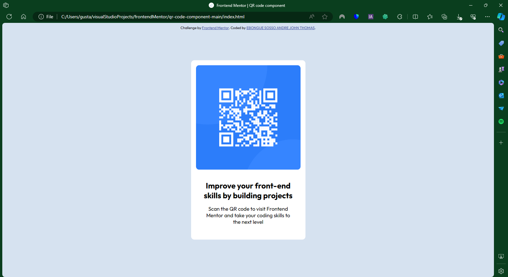

# Frontend Mentor - QR code component solution

This is a solution to the [QR code component challenge on Frontend Mentor](https://www.frontendmentor.io/challenges/qr-code-component-iux_sIO_H). Frontend Mentor challenges help you improve your coding skills by building realistic projects. 

## Table of contents

*div(the main component of this exercise):
    'img' this is my image component
    'p.text1' this is my first paragraph
    'p.text2' this is my second paragraph

- [Frontend Mentor - QR code component solution](#frontend-mentor---qr-code-component-solution)
  - [Table of contents](#table-of-contents)
  - [Overview](#overview)
    - [Screenshot](#screenshot)
    - [Links](#links)
  - [My process](#my-process)
    - [Built with](#built-with)
    - [What I learned](#what-i-learned)
    - [Continued development](#continued-development)
    - [Useful resources](#useful-resources)
  - [Author](#author)
  - [Acknowledgments](#acknowledgments)

**Note: Delete this note and update the table of contents based on what sections you keep.**

## Overview

The QR code component povide a simple and responsive dispay of a QRCode and this title an small description

### Screenshot

Add a screenshot of your solution. The easiest way to do this is to use Firefox to view your project, right-click the page and select "Take a Screenshot". You can choose either a full-height screenshot or a cropped one based on how long the page is. If it's very long, it might be best to crop it.

Alternatively, you can use a tool like [FireShot](https://getfireshot.com/) to take the screenshot. FireShot has a free option, so you don't need to purchase it. 

Then crop/optimize/edit your image however you like, add it to your project, and update the file path in the image above.

**Note: Delete this note and the paragraphs above when you add your screenshot. If you prefer not to add a screenshot, feel free to remove this entire section.**

### Links

- Solution URL: [https://github.com/thofelix6/thofelix6.github.io](https://github.com/thofelix6/thofelix6.github.io)
- Live Site URL: [https://thofelix6.github.io](https://thofelix6.github.io/)

## My process

For this exercise I've used HTML5 and CSS3 programming language. For code it I've used VSCode as code editor and used git and github as version control. In this exercise we have a design folder in which there are some image about how the site have to look, the images folder in which there are all image needed for thsi exercise; the idex.html for creating all component and the style.css to add some style toour components.

### Built with

- Semantic HTML5 markup
- CSS custom properties
- Flexbox
- CSS Grid
- Mobile-first workflow

### What I learned

In this exercise I have learn how to use the 'class' option, how to center a component in the middle of a screen as well as responsible for any device

### Continued development

i would like to know more about stylizing, transition and responsive of a website

### Useful resources

- [CHATGPT](https://openai.com/chatgpt) - This helped me to know how to center a component.

## Author

- Website - [EBONGUE SOSSO ANDRE JOHN THOMAS](https://thofelix6.github.io/)
- Frontend Mentor - [@thofelix6](https://www.frontendmentor.io/profile/thofelix6)

## Acknowledgments

If I've got some mistakes in coding please give me a feedback. Thanks. :)